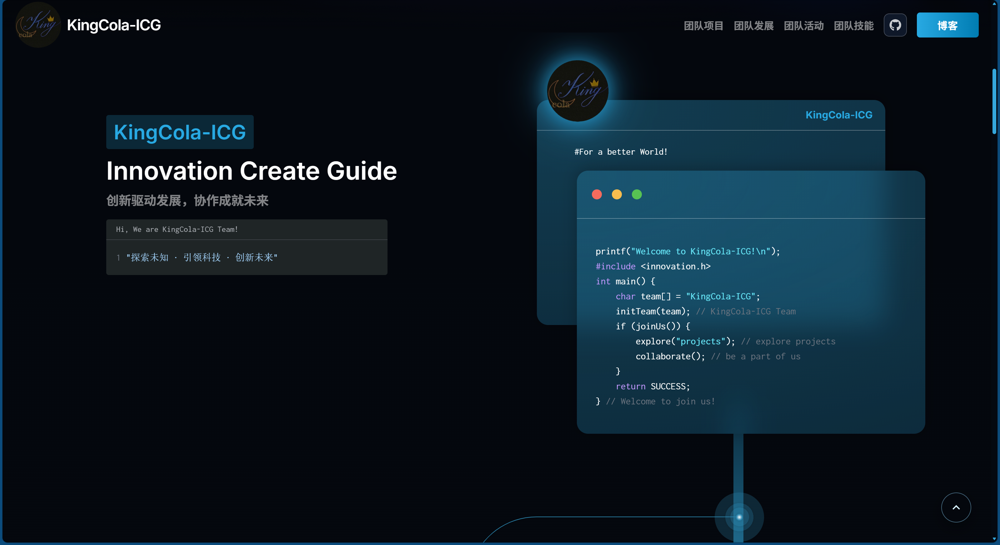
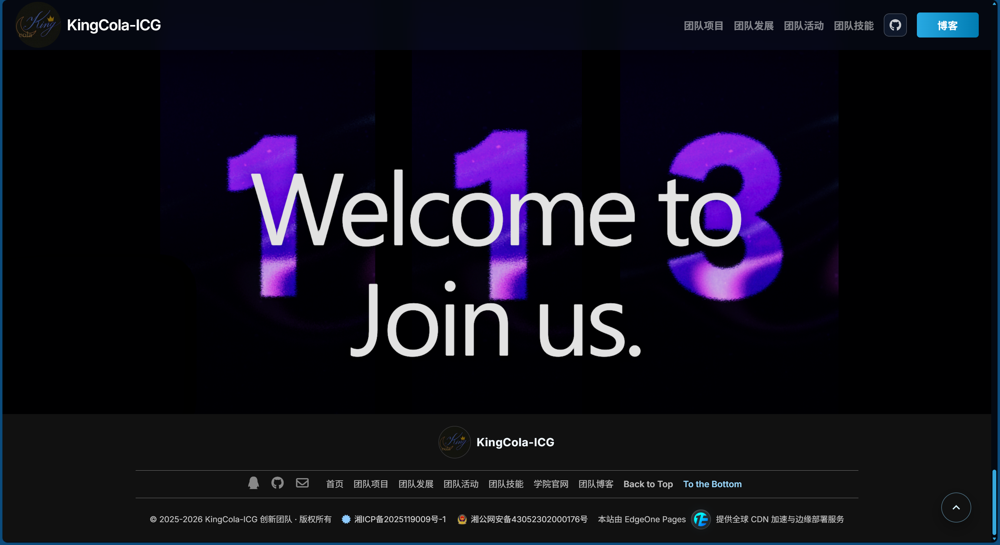

<div align="right">
  <a href="./README.md">English</a> | <a href="./README.zh-CN.md">简体中文</a>
</div>

# KingCola-ICG Official Website

This repository contains the frontend source code of the KingCola-ICG official website.  
It is built with React + Vite and includes homepage visuals, project showcase, Markdown-driven project detail pages, events, development timeline, and skills pages.

<p align="center">
  
  
  
  
  
  
  
  
</p>

## 1. Overview

- Project name: `kingcola-icg-official-website`
- Type: Visual-first team official website
- Runtime model: Static frontend site currently suited for GitHub Pages, EdgeOne Pages, Nginx, and Vercel

## Preview

### Hero Section


### Main Content Area



### Footer and Overall Atmosphere



## 2. Tech Stack

- `React 18`
- `Vite 6`
- `React Router DOM 6`
- `Tailwind CSS`
- `Framer Motion`
- `@react-three/fiber` + `@react-three/drei` + `three`
- `React Markdown` + `remark-gfm`

## 3. Routes

Current routes are defined in `src/App.jsx`:

- `/` Home
- `/projects` Project list
- `/projects/:id` Project detail
- `/envents` Events page (kept for backward compatibility)
- `/development` Development timeline
- `/skills` Skills page
- `*` 404 page

## 4. Project Structure

```text
.
├─ docs/
│  └─ img/                   # Preview screenshots for documentation
├─ deploy/                   # Nginx config templates
├─ public/                   # Public static assets
├─ scripts/
│  └─ compress-dist.mjs      # Generate pre-compressed .gz/.br files after build
├─ src/
│  ├─ assets/                # Images, 3D models, Markdown, styles
│  ├─ components/            # Shared and visual components
│  ├─ constants/             # Structured static data
│  ├─ hooks/                 # Business hooks
│  ├─ pages/                 # Route pages
│  ├─ App.jsx                # Router and global layout
│  └─ main.jsx               # App entry
├─ index.html
├─ package.json
├─ README.en.md
├─ README.zh-CN.md
├─ vercel.json
└─ vite.config.js
```

## 5. Local Development

### 5.1 Requirements

- Node.js `>= 18` (LTS recommended)
- npm `>= 9`

### 5.2 Install Dependencies

```bash
npm install
```

### 5.3 Start Dev Server

```bash
npm run dev
```

Dev server options from `vite.config.js`:

- `PORT` or `VITE_DEV_PORT` with default `8081`
- `VITE_DEV_OPEN` with default `true`

### 5.4 Preview Production Build

```bash
npm run build
npm run serve
```

## 6. Build Notes

### 6.1 Build Commands

- `npm run build:raw`: Vite build only
- `npm run build`: Vite build plus the pre-compression step

### 6.2 Pre-compression

`scripts/compress-dist.mjs` scans `dist/` and generates:

- `*.gz`
- `*.br`

When Nginx is configured with `gzip_static on;` and `brotli_static on;`, these files can be served directly for better performance.

## 7. Content Maintenance

### 7.1 Project Content

Project list and details are driven by `src/assets/md/projects/*.md`.  
Parsing logic lives in `src/constants/projectsData.js`.

Template file:

- `src/assets/md/projects/_template.md`

Main frontmatter fields:

- `id`: route id for `/projects/:id`
- `name`: project name
- `description`: one-line summary
- `techStack`: tech stack array
- `keywords`: keyword and member tags
- `order`: sort weight where smaller means earlier

Markdown body content is rendered automatically on the project detail page.

### 7.2 Events Content

Edit `src/constants/Events.js`:

- `EventsTop`: top carousel
- `programs`: timeline and event list

### 7.3 Development Timeline

Edit `src/constants/developmentTimeline.js`.

### 7.4 Blog Data

Edit `src/constants/Blogs/Articles.js`.

## 8. Deployment

### 8.1 GitHub Pages Automated Deployment

The repository already includes the GitHub Pages workflow:

- `.github/workflows/deploy.yml`

Trigger methods:

- automatic on `push main`
- manual via `workflow_dispatch`

The workflow automatically:

- installs dependencies
- runs `npm run build:raw`
- uploads `dist/` as the Pages artifact
- deploys the site to GitHub Pages

Requirements:

- enable `GitHub Actions` under `Settings -> Pages`
- if your default branch is not `main`, update the branch in `.github/workflows/deploy.yml`

Notes:

- this workflow no longer depends on a remote server, SSH key, or server-side target directory
- deployment auth is handled by GitHub's official Pages actions

### 8.2 EdgeOne Pages

This site can also be deployed directly to `EdgeOne Pages` for static hosting, CDN acceleration, and edge delivery.

Recommended settings:

- Build command: `npm run build`
- Output directory: `dist`
- SPA fallback: rewrite all sub-routes to `/index.html`

### 8.3 Nginx

References:

- `deploy/nginx.conf` for a generic template
- `deploy/nginx.www.kingcola-icg.cn.conf` for the domain-specific sample

For SPA routing, keep:

- `try_files $uri $uri/ /index.html;`

Recommended caching strategy:

- disable strong cache for `index.html`
- keep long cache plus `immutable` for hashed assets
- enable `gzip_static` and `brotli_static` when available

### 8.4 Vercel

`vercel.json` is included and already configured for SPA rewrites.

## 9. UX Notes

- Loading state includes timeout hints, retry, and return-home fallback for weak networks
- Full-screen route loading is used during first load and tab transitions for a smoother experience
- Navbar and footer stay hidden during route transitions until the next page is fully ready
- Homepage 3D presentation has mobile compatibility optimizations

## 10. Common Issues

### 10.1 404 on Refreshing a Sub-route

Cause: SPA fallback is missing on the host server.  
Fix: ensure `try_files $uri $uri/ /index.html;` or equivalent rewrite fallback is configured.

### 10.2 New Project Not Showing Up

Checklist:

- Markdown file is under `src/assets/md/projects/`
- `id` in frontmatter is valid
- `order` is set as expected
- build cache or CDN cache has been refreshed

### 10.3 Mismatch Between HTML and Hashed Assets

Ensure `index.html` is not strongly cached to avoid old entry files referencing new asset hashes.

## 11. Open-source Security Notes

- Never commit real secrets, certificate keys, or passwords
- Use placeholders in public Nginx samples
- Review `.env` before publishing

## 12. Contribution Notes

Please read the full contribution guide first:

- [CONTRIBUTING.md](./CONTRIBUTING.md)

Recommended collaboration rules:

- create branches from `main`
- keep one PR focused on one topic only
- run `npm run dev` and `npm run build` before opening a PR
- include verification steps and screenshots when the UI is affected
- explain deployment impact clearly if `.github/workflows`, `public`, routing, or asset paths are changed

Recommended branch naming:

- `feat/<short-description>`
- `fix/<short-description>`
- `docs/<short-description>`
- `refactor/<short-description>`

PR description should include:

- what changed
- why the change is needed
- affected pages or modules
- local verification steps
- screenshots or recordings for UI changes
- known risks or follow-up items
